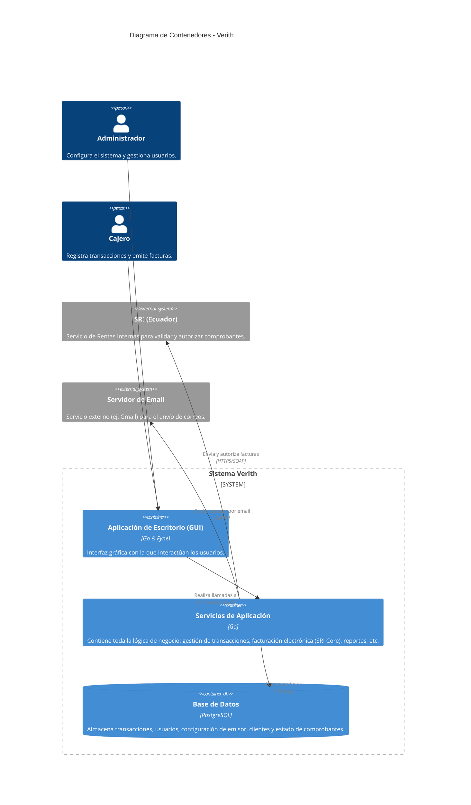

```mermaid
C4Container
  title Diagrama de Contenedores - Verith

  Person(admin, "Administrador", "Configura el sistema y gestiona usuarios.")
  Person(cashier, "Cajero", "Registra transacciones y emite facturas.")

  System_Ext(sri, "SRI (Ecuador)", "Servicio de Rentas Internas para validar y autorizar comprobantes.")
  System_Ext(smtp, "Servidor de Email", "Servicio externo (ej. Gmail) para el envío de correos.")

  System_Boundary(c1, "Sistema Verith") {

      Container(gui, "Aplicación de Escritorio (GUI)", "Go & Fyne", "Interfaz gráfica con la que interactúan los usuarios.")

      Container(app_services, "Servicios de Aplicación", "Go", "Contiene toda la lógica de negocio: gestión de transacciones, facturación electrónica (SRI Core), reportes, etc.")

      ContainerDb(db, "Base de Datos", "PostgreSQL", "Almacena transacciones, usuarios, configuración de emisor, clientes y estado de comprobantes.")

      Rel(gui, app_services, "Realiza llamadas a", "Go function calls")
      Rel(app_services, db, "Lee y escribe en", "SQL/pgx")
  }

  Rel(admin, gui, "Usa")
  Rel(cashier, gui, "Usa")

  Rel(app_services, sri, "Envía y autoriza facturas", "HTTPS/SOAP")
  Rel(app_services, smtp, "Envía facturas por email", "SMTP")

  UpdateRelStyle(gui, app_services, $textColor="gray", $offsetY="40",$offsetX="-70")
  UpdateRelStyle(app_services, db, $textColor="gray", $offsetY="40")
  UpdateRelStyle(admin, gui, $textColor="gray", $offsetY="-40")
  UpdateRelStyle(cashier, gui, $textColor="gray", $offsetY="40")
  UpdateRelStyle(app_services, sri, $textColor="gray", $offsetY="-40")
  UpdateRelStyle(app_services, smtp, $textColor="gray")
```
