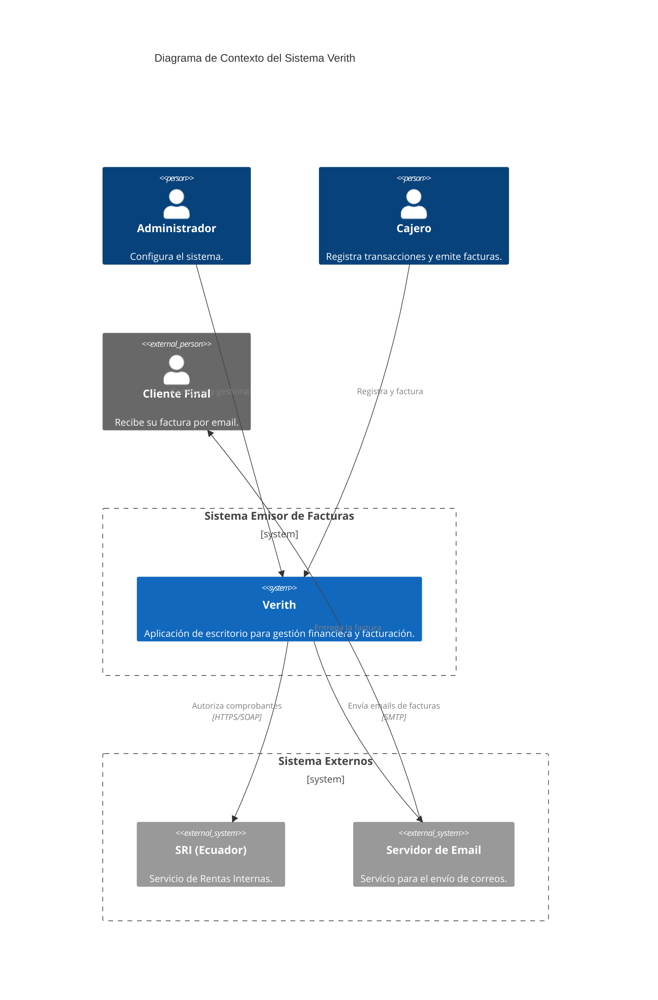

```mermaid
C4Context
  title Diagrama de Contexto del Sistema Verith

  Person(admin, "Administrador", "Configura el sistema.")
  Person(cashier, "Cajero", "Registra transacciones y emite facturas.")

  Boundary(b1, "Sistema Emisor de Facturas") {
  System(app, "Verith", "Aplicación de escritorio para gestión financiera y facturación.")
}

  Boundary(b2, "Sistema Externos") {
  System_Ext(sri, "SRI (Ecuador)", "Servicio de Rentas Internas.")
  System_Ext(smtp, "Servidor de Email", "Servicio para el envío de correos.")
}

  Person_Ext(customer, "Cliente Final", "Recibe su factura por email.")

  Rel(admin, app, "Configura y gestiona")
  Rel(cashier, app, "Registra y factura")
  Rel(app, sri, "Autoriza comprobantes", "HTTPS/SOAP")
  Rel(app, smtp, "Envía emails de facturas", "SMTP")
  Rel_D(smtp, customer, "Entrega la factura")

  UpdateRelStyle(admin, app, $textColor="gray", $offsetY="-45",$offsetX="-100")
  UpdateRelStyle(cashier, app, $textColor="gray", $offsetY="-45")
  UpdateRelStyle(app, sri, $textColor="gray", $offsetY="-40",$offsetX="-100")
  UpdateRelStyle(app, smtp, $textColor="gray", $offsetY="-40",$offsetX="-30")
  UpdateRelStyle(smtp, customer, $textColor="gray")

  UpdateLayoutConfig($c4ShapeInRow="3", $c4BoundaryInRow="1")
```
