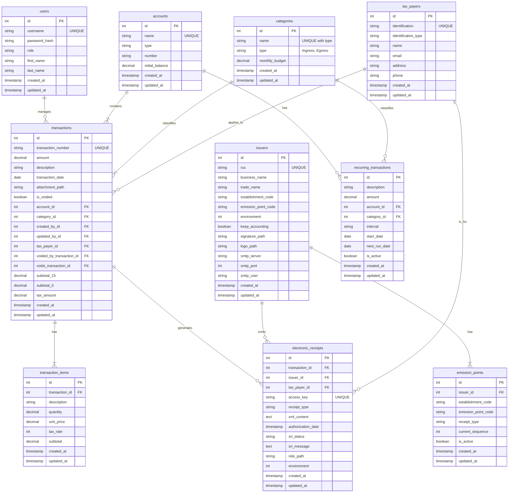

```mermaid
erDiagram
    users ||--o{ transactions : "manages"
    accounts ||--|{ transactions : "contains"
    categories ||--|{ transactions : "classifies"
    tax_payers ||--o{ transactions : "applies_to"

    transactions ||--|{ transaction_items : "has"
    transactions ||--o{ electronic_receipts : "generates"

    issuers ||--|{ emission_points : "has"
    issuers ||--o{ electronic_receipts : "emits"

    tax_payers ||--o{ electronic_receipts : "is_for"

    accounts ||--o{ recurring_transactions : "has"
    categories ||--o{ recurring_transactions : "classifies"

    users {
        int id PK
        string username "UNIQUE"
        string password_hash
        string role
        string first_name
        string last_name
        timestamp created_at
        timestamp updated_at
    }

    accounts {
        int id PK
        string name "UNIQUE"
        string type
        string number
        decimal initial_balance
        timestamp created_at
        timestamp updated_at
    }

    categories {
        int id PK
        string name "UNIQUE with type"
        string type "Ingreso, Egreso"
        decimal monthly_budget
        timestamp created_at
        timestamp updated_at
    }

    transactions {
        int id PK
        string transaction_number "UNIQUE"
        decimal amount
        string description
        date transaction_date
        string attachment_path
        boolean is_voided
        int account_id FK
        int category_id FK
        int created_by_id FK
        int updated_by_id FK
        int tax_payer_id FK
        int voided_by_transaction_id FK
        int voids_transaction_id FK
        decimal subtotal_15
        decimal subtotal_0
        decimal tax_amount
        timestamp created_at
        timestamp updated_at
    }

    transaction_items {
        int id PK
        int transaction_id FK
        string description
        decimal quantity
        decimal unit_price
        int tax_rate
        decimal subtotal
        timestamp created_at
        timestamp updated_at
    }

    tax_payers {
        int id PK
        string identification "UNIQUE"
        string identification_type
        string name
        string email
        string address
        string phone
        timestamp created_at
        timestamp updated_at
    }

    issuers {
        int id PK
        string ruc "UNIQUE"
        string business_name
        string trade_name
        string establishment_code
        string emission_point_code
        int environment
        boolean keep_accounting
        string signature_path
        string logo_path
        string smtp_server
        int smtp_port
        string smtp_user
        timestamp created_at
        timestamp updated_at
    }

    emission_points {
        int id PK
        int issuer_id FK
        string establishment_code
        string emission_point_code
        string receipt_type
        int current_sequence
        boolean is_active
        timestamp created_at
        timestamp updated_at
    }

    electronic_receipts {
        int id PK
        int transaction_id FK
        int issuer_id FK
        int tax_payer_id FK
        string access_key "UNIQUE"
        string receipt_type
        text xml_content
        timestamp authorization_date
        string sri_status
        text sri_message
        string ride_path
        int environment
        timestamp created_at
        timestamp updated_at
    }

    recurring_transactions {
        int id PK
        string description
        decimal amount
        int account_id FK
        int category_id FK
        string interval
        date start_date
        date next_run_date
        boolean is_active
        timestamp created_at
        timestamp updated_at
    }
```

