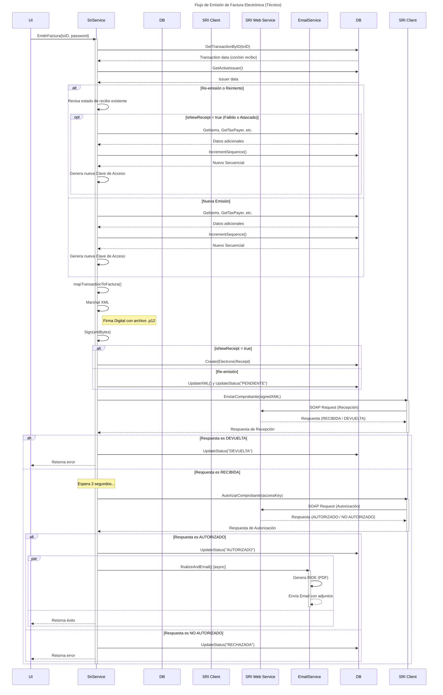

```mermaid
sequenceDiagram
    title Flujo de Emisión de Factura Electrónica (Técnico)

    participant UI
    participant SriService
    participant Repositories as DB
    participant SRI_Client as SRI Client
    participant SRI_WS as SRI Web Service
    participant EmailService

    UI->>SriService: EmitirFactura(txID, password)

    activate SriService

    SriService->>DB: GetTransactionByID(txID)
    DB-->>SriService: Transaction data (con/sin recibo)

    SriService->>DB: GetActiveIssuer()
    DB-->>SriService: Issuer data

    alt Re-emisión o Reintento
        SriService->>SriService: Revisa estado de recibo existente
        opt isNewReceipt = true (Fallido o Atascado)
            SriService->>DB: GetItems, GetTaxPayer, etc.
            DB-->>SriService: Datos adicionales
            SriService->>DB: IncrementSequence()
            DB-->>SriService: Nuevo Secuencial
            SriService->>SriService: Genera nueva Clave de Acceso
        end
    else Nueva Emisión
        SriService->>DB: GetItems, GetTaxPayer, etc.
        DB-->>SriService: Datos adicionales
        SriService->>DB: IncrementSequence()
        DB-->>SriService: Nuevo Secuencial
        SriService->>SriService: Genera nueva Clave de Acceso
    end

    SriService->>SriService: mapTransactionToFactura()
    SriService->>SriService: Marshal XML

    note right of SriService: Firma Digital con archivo .p12
    SriService->>SriService: Sign(xmlBytes)

    alt isNewReceipt = true
        SriService->>DB: Create(ElectronicReceipt)
    else Re-emisión
        SriService->>DB: UpdateXML() y UpdateStatus("PENDIENTE")
    end

    SriService->>SRI Client: EnviarComprobante(signedXML)
    activate SRI Client
    SRI Client->>SRI_WS: SOAP Request (Recepción)
    SRI_WS-->>SRI Client: Respuesta (RECIBIDA / DEVUELTA)
    SRI Client-->>SriService: Respuesta de Recepción
    deactivate SRI Client

    alt Respuesta es DEVUELTA
        SriService->>DB: UpdateStatus("DEVUELTA")
        SriService-->>UI: Retorna error
    else Respuesta es RECIBIDA

        note over SriService: Espera 3 segundos...

        SriService->>SRI Client: AutorizarComprobante(accessKey)
        activate SRI Client
        SRI Client->>SRI_WS: SOAP Request (Autorización)
        SRI_WS-->>SRI Client: Respuesta (AUTORIZADO / NO AUTORIZADO)
        SRI Client-->>SriService: Respuesta de Autorización
        deactivate SRI Client

        alt Respuesta es AUTORIZADO
            SriService->>DB: UpdateStatus("AUTORIZADO")

            par
                SriService->>EmailService: finalizeAndEmail() [async]
                activate EmailService
                EmailService->>EmailService: Genera RIDE (PDF)
                EmailService-->>EmailService: Envía Email con adjuntos
                deactivate EmailService
            and
                SriService-->>UI: Retorna éxito
            end

        else Respuesta es NO AUTORIZADO
            SriService->>DB: UpdateStatus("RECHAZADA")
            SriService-->>UI: Retorna error
        end
    end
    deactivate SriService
```
