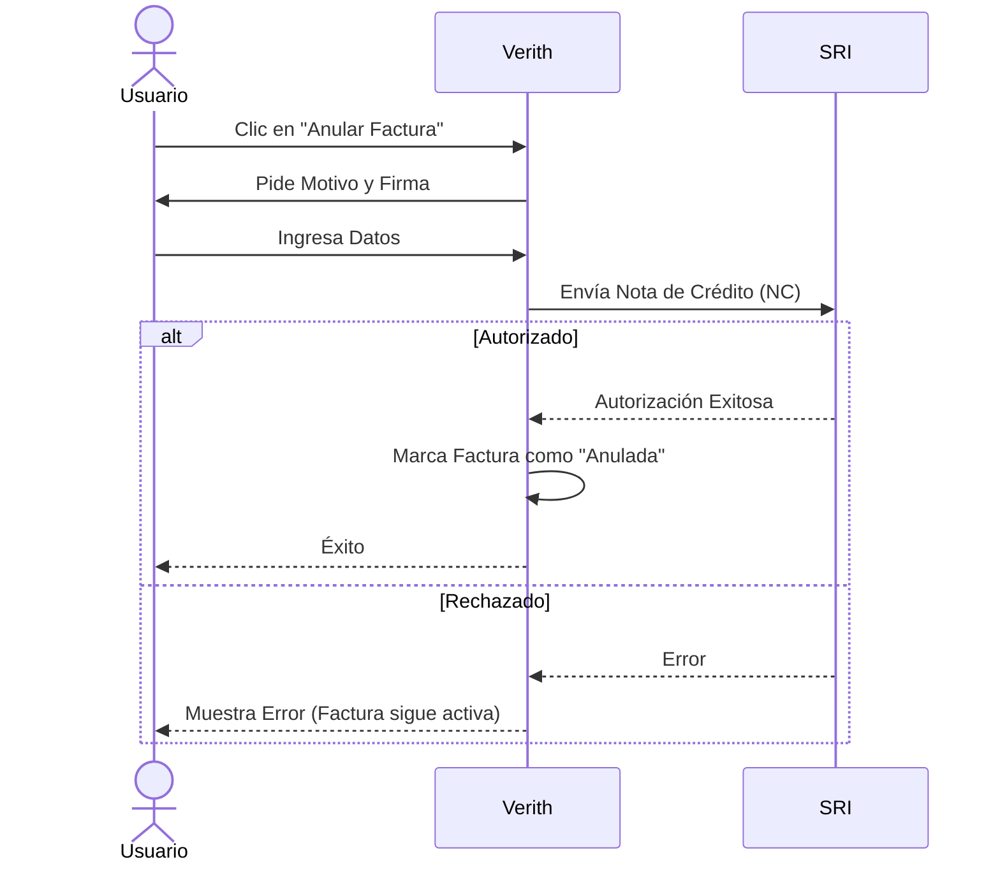

# Notas de Crédito

Anula facturas autorizadas de forma legal y automática.

## Cómo anular una factura

1.  En la tabla de transacciones, busca la factura autorizada (icono ✅).
2.  Haz clic en el botón **Anular** (icono rojo).
3.  Ingresa el **Motivo** de la anulación y tu contraseña de firma.
4.  El sistema generará una **Nota de Crédito (Tipo 04)** y la enviará al SRI.

*Importante:* Una vez autorizada la Nota de Crédito, la transacción original se marcará como anulada en Verith.
