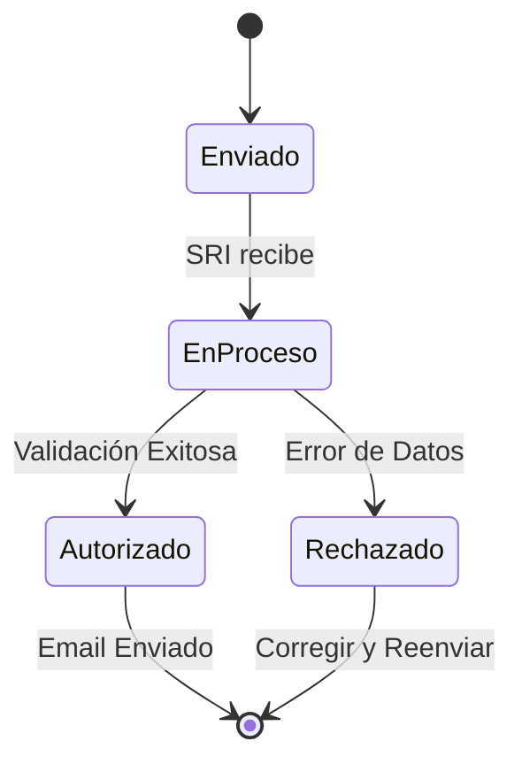

# Emitir Facturas Electrónicas

Verith emite la factura automáticamente al crear una transacción de tipo **Ingreso**.

1.  Crea una nueva transacción.
2.  Asegúrate de seleccionar un cliente válido (con RUC/Cédula y correo).
3.  Al guardar, el sistema enviará la factura al SRI.

## Estados del SRI

En la tabla de transacciones verás un icono de estado:
*   ✅ **Autorizado:** Todo correcto. El cliente recibió el correo.
*   🕒 **En Proceso:** El SRI está validando.
*   ❌ **Devuelta/Rechazada:** Hubo un error. Pasa el mouse sobre el icono para ver el motivo.

## Flujo de Estado

