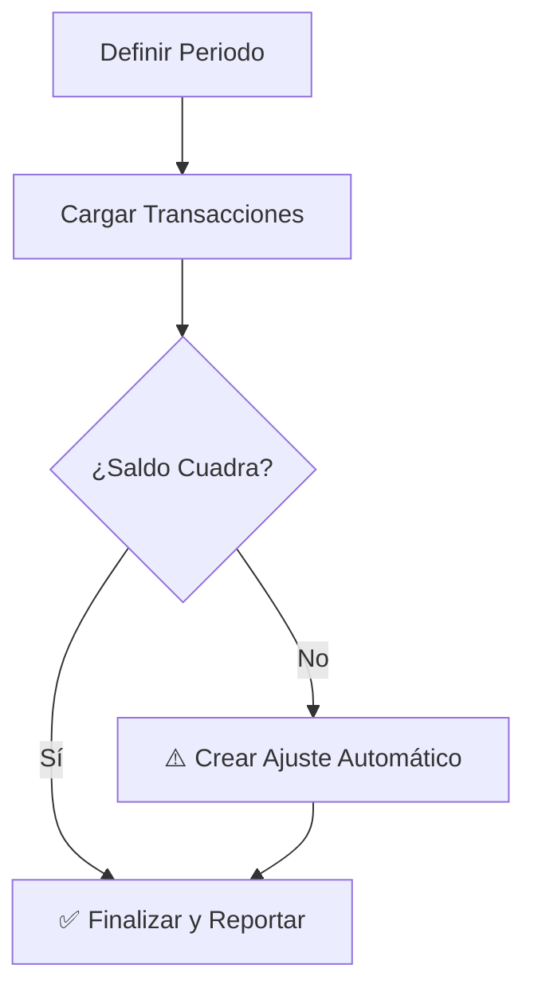

# 🔍 Reconciliación de Caja

La reconciliación es un proceso de control fundamental en **Verith**. Te permite asegurar que el saldo registrado en el sistema coincida perfectamente con el dinero real.

---

:::caution Acceso Restringido
Este módulo es una herramienta de auditoría y control. Por tanto, solo está disponible para usuarios con roles de **Administrador** o **Supervisor**. Los cajeros no verán el botón de "Reconciliar" en su barra de herramientas.
:::

## Guía del Proceso

### 1. Iniciar el Proceso
1.  Dirígete a la pestaña **Transacciones**.
2.  Haz clic en el botón **"Reconciliar"** (icono de portapapeles 📋).
3.  Se abrirá la ventana de **Reconciliación de Cuenta**.

### 2. Configurar el Período
Ingresa los datos de control:
*   **Cuenta:** Banco o Caja a auditar.
*   **Saldo Final Real:** El monto exacto que tienes físicamente o en tu extracto bancario.

### 3. Análisis de Diferencias
El sistema comparará el **Saldo Calculado** vs. el **Saldo Real**.
*   **Diferencia = $0:** Tu contabilidad cuadra perfectamente.
*   **Diferencia ≠ $0:** Existe un descuadre que debe ser investigado o ajustado.

