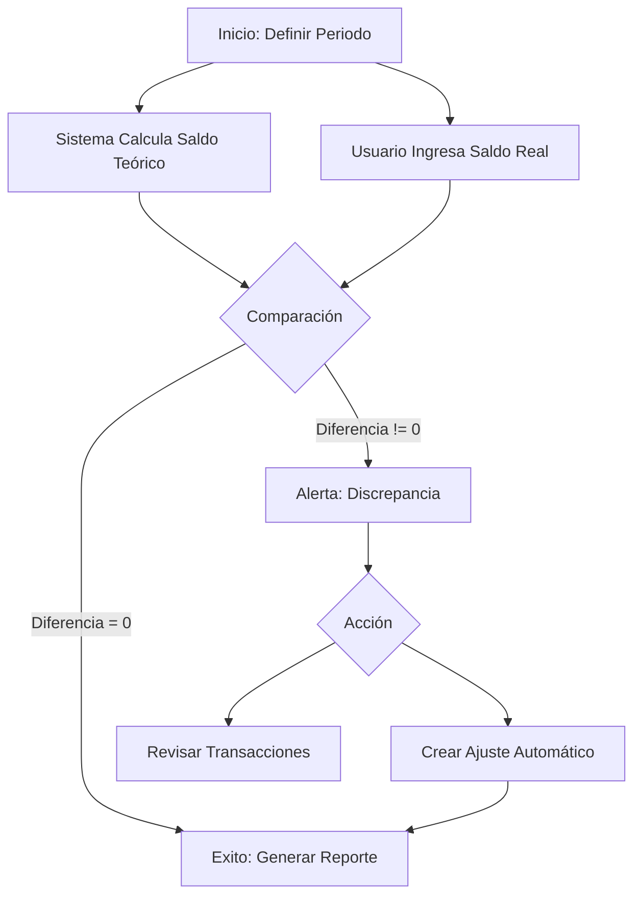

# Reconciliación de Caja

La reconciliación es un proceso de control fundamental en **Verith**. Te permite asegurar que el saldo registrado en el sistema coincida perfectamente con el dinero real que tienes en tu cuenta bancaria o en tu caja física.

## ¿Por qué es importante?

*   Detecta errores de digitación (ej: ingresar $10 en lugar de $100).
*   Identifica transacciones olvidadas o duplicadas.
*   Garantiza que tus reportes financieros sean veraces.

---

## Guía Paso a Paso

### 1. Iniciar el Proceso
1.  Dirígete a la pestaña **Transacciones**.
2.  Haz clic en el botón **"Reconciliar"** (icono de portapapeles 📋) en la barra de herramientas superior.
3.  Se abrirá la ventana de **Reconciliación de Cuenta**.

![Placeholder: Captura del botón 'Reconciliar' en la barra de herramientas]

### 2. Configurar el Período
En el formulario inicial, debes ingresar los datos de control:

*   **Cuenta:** Selecciona qué cuenta vas a auditar (ej: "Banco Pichincha" o "Caja Principal").
*   **Fecha de Inicio:** Desde cuándo quieres revisar (usualmente el día siguiente a tu última reconciliación).
*   **Fecha de Cierre:** Hasta cuándo vas a cortar (ej: el día de hoy o fin de mes).
*   **Saldo Final Real:** Este es el dato clave. Ingresa aquí el monto exacto que ves en tu extracto bancario o el total de dinero que contaste físicamente en tu caja.

Una vez llenos los datos, haz clic en **"Iniciar Reconciliación"**.

![Placeholder: Captura del formulario de inicio de reconciliación]

### 3. Análisis de Resultados (El Estado de Cuenta)
El sistema calculará automáticamente todos los movimientos registrados en ese periodo y te presentará un resumen con tres valores críticos:

1.  **Saldo Calculado:** Es el dinero que el sistema *cree* que deberías tener, basado en el saldo inicial histórico + ingresos - egresos.
2.  **Saldo Real:** Es el valor que tú ingresaste.
3.  **Diferencia:** La resta entre ambos.
    *   Si es **$0.00**, ¡Felicidades! Tu contabilidad es perfecta.
    *   Si es **diferente de cero**, significa que falta o sobra dinero en el sistema respecto a la realidad.

### 4. Resolver Discrepancias
Si tienes una diferencia, Verith te ayuda a solucionarla de dos formas:

#### A. Revisión Manual
Revisa la lista de transacciones que aparece en la parte inferior de la ventana. Compara línea por línea con tu extracto bancario para encontrar el error. Si encuentras una transacción faltante, puedes cancelar la reconciliación, agregarla y volver a empezar.

#### B. Ajuste Automático (Recomendado para diferencias menores)
Si la diferencia es pequeña (ej: centavos por redondeo o comisiones no registradas) y no encuentras el origen, puedes usar el botón **"Crear Transacción de Ajuste"**.

1.  El sistema abrirá un diálogo para crear una transacción automática.
2.  Selecciona una categoría especial (ej: "Ajuste de Caja" o "Otros Gastos").
3.  Verith llenará automáticamente el monto necesario para que la diferencia sea cero.
4.  Al guardar, tu saldo calculado se igualará al saldo real.

![Placeholder: Captura del diálogo de creación de ajuste]

### 5. Finalización
Una vez que la **Diferencia sea $0.00** (ya sea porque estaba cuadra o porque hiciste un ajuste), puedes:

*   **Generar Reporte:** Exporta un PDF con el acta de reconciliación firmada digitalmente por el sistema, detallando el periodo y el saldo validado.
*   **Finalizar:** Cierra el proceso. Tu cuenta ahora está saneada y lista para el siguiente periodo.

![Placeholder: Captura del reporte de reconciliación PDF]