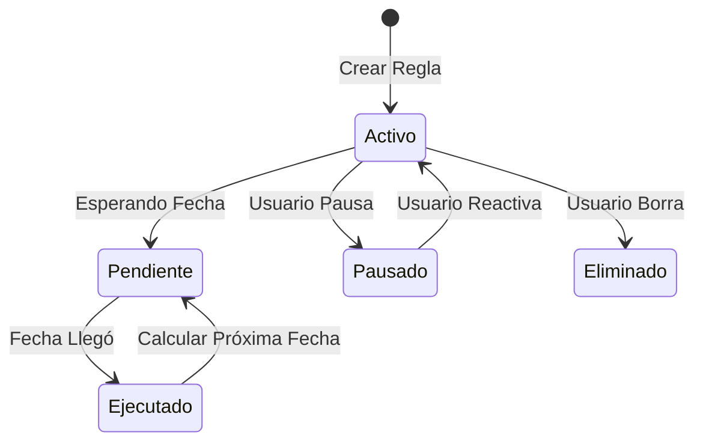

# Transacciones Recurrentes

Automatiza tus gastos fijos para ahorrar tiempo y evitar olvidos.

## Configurar una Regla Recurrente

1.  En la pestaña **Transacciones**, haz clic en el botón **"Recurrentes"** (icono de reloj/historial).
2.  Haz clic en **"Nueva"**.
3.  Define el monto, la cuenta, la categoría y la **Frecuencia** (Semanal o Mensual).
4.  Establece la **Próxima Ejecución**.

## Cómo funciona

Cada vez que inicies Verith, el sistema verificará si hay transacciones programadas para hoy o fechas pasadas y las registrará automáticamente por ti.
