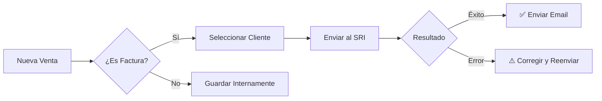

# 📝 Transacciones Diarias

El módulo de transacciones es el corazón operativo de Verith. Aquí se registran todos los movimientos de dinero, tanto de ingresos como de egresos.

---

## 📊 La Tabla de Transacciones

Nuestra tabla está diseñada para darte información clave de un vistazo:

| Columna | Descripción |
| :--- | :--- |
| **#** | Número secuencial interno de la transacción. |
| **Fecha** | Fecha del movimiento (admite fechas pasadas). |
| **Descripción** | Concepto del gasto o venta. |
| **Categoría** | Clasificación para tus reportes. |
| **Monto** | Valor total (Verde para ingresos, Rojo para egresos). |
| **Saldo** | Saldo proyectado de la cuenta (Oculto para cajeros). |
| **SRI** | Estado de la factura electrónica (Ver iconos abajo). |
| **Adjunto** | Enlace para ver el PDF o imagen respaldada. |

---

## ☁️ Estados del SRI

A través de iconos intuitivos, Verith te informa el estado de tus documentos legales:

*   ✅ **Confirmado:** Documento **AUTORIZADO** legalmente por el SRI.
*   🕒 **Reloj:** Documento en cola o **EN PROCESO** de envío.
*   ⚠️ **Advertencia:** Documento **DEVUELTO** o **RECHAZADO**. Revisa el mensaje de error pasando el mouse.
*   ❌ **Error:** Documento **NO AUTORIZADO** o error crítico de conexión.

---

## 🖇️ Gestión de Adjuntos

:::tip Digitaliza tus respaldos
Al crear o editar una transacción, puedes adjuntar una foto del recibo o un PDF de la transferencia. Verith guardará una copia local y podrás visualizarla haciendo clic en el nombre del archivo en la tabla.
:::

---

## 🔄 Flujo de Trabajo SOLID

