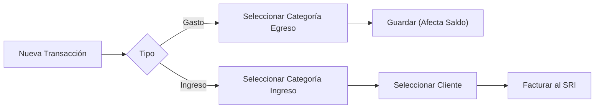

# Transacciones Diarias

El registro de transacciones es el corazón de Verith.

## Registrar un Ingreso o Gasto

1.  Ve a la pestaña **Transacciones**.
2.  Haz clic en **"Agregar Transacción"**.
3.  Llena los campos:
    *   **Monto:** Valor total (incluido impuestos).
    *   **Categoría:** Clasifica el movimiento (ej: "Ventas", "Servicios Básicos").
    *   **Cliente:** (Opcional para gastos menores, obligatorio para facturas > $50).

## Editar y Anular

*   **Editar:** Solo puedes editar transacciones que **no** han sido autorizadas por el SRI.
*   **Anular:** Si una transacción fue facturada electrónicamente, usar la opción "Anular" generará automáticamente una **Nota de Crédito** para mantener la legalidad.

![Placeholder: Captura de las acciones en la tabla de transacciones]
